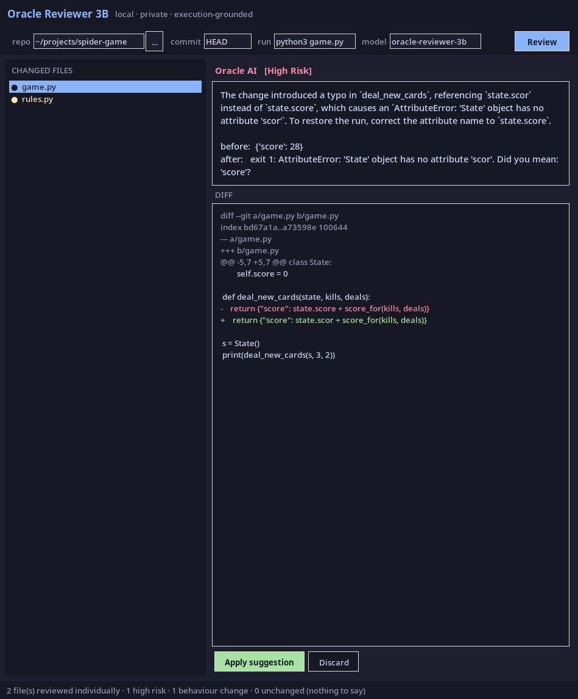
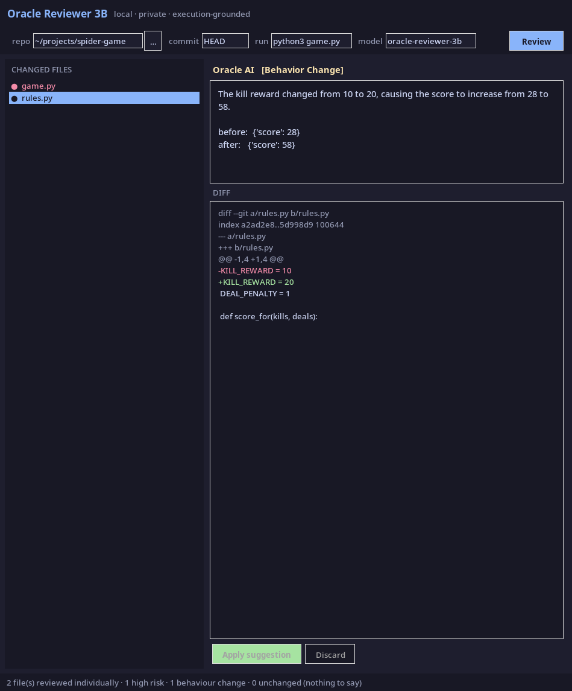

# Oracle Reviewer 3B

A code reviewer that runs your code before it says anything.

Fully local, fully private. A fine-tuned 3B model, a Tkinter desktop app, and no
network calls beyond your own machine — no cloud API, no GitHub integration, no
telemetry.



---

## The idea in one line

**Risk is measured, not guessed.**

Most AI reviewers read a diff and form an opinion. This one checks out your
repository at the previous commit, applies **one changed file**, runs your
project's own command, and compares the result. Only then does the model speak,
and only about a difference that has already been observed.

That is where the low false-positive rate comes from. It is not that the model
is unusually accurate — it is that the tool refuses to make a claim that
execution has not already established.

## Two kinds of output, decided by the run

### High Risk — the code now fails

Reported only when the project ran clean before your change and fails after it.
Not a hunch: an exit code and an exception.

> **Oracle AI** `[High Risk]`
>
> The change introduced a typo in `deal_new_cards`, referencing `state.scor`
> instead of `state.score`, which causes an
> `AttributeError: 'State' object has no attribute 'scor'`. To restore the run,
> correct the attribute name to `state.score`.
>
> ```diff
> - return {"score": state.scor + score_for(kills, deals)}
> + return {"score": state.score + score_for(kills, deals)}
> ```

### Behavior Change — it still works, it just does something different

No accusation, no speculation about bugs. One sentence saying what changed.



> **Oracle AI** `[Behavior Change]`
>
> The kill reward changed from 10 to 20, causing the score to increase from
> 28 to 58.

A style change or a tuning tweak gets a sentence. A crash gets a paragraph and
a fix. Nothing gets an invented bug report.

## One file at a time — and that is a measurement, not a formatting choice

The reviewer never evaluates a whole commit at once. For each changed file it
builds a worktree at the parent commit, applies **only that file**, and runs.

That does two things. It keeps each prompt small, so the model never sees a
sprawling multi-file diff and starts hallucinating hunks. More importantly, it
makes *which file broke it* an observation instead of an opinion — a commit
touching five files produces five independent verdicts.

A real example from the test suite. One commit, one message, two files:

```
commit: "balance: bump kill reward and tidy dealNewCards"

  game.py    High Risk         {'score': 28}  ->  exit 1: AttributeError: ... 'scor'
  rules.py   Behavior Change   {'score': 28}  ->  {'score': 58}
```

The message mentions neither the crash nor which file causes it. Running each
file alone does.

## Quick start

```bash
# 1. serve the model locally (the bundled server; Ollama or llama.cpp also work)
MODEL=artifacts/oracle-reviewer-3b ./serve.sh start   # exposes http://localhost:8111

# 2. run the app
python -m oracle_reviewer.tui --repo ~/code/thing
```

**Any language.** Nothing about the review is language-specific: it runs a
command and compares the output. What *is* language-specific is knowing which
command, so the run command is detected from the repository — `package.json`
scripts (with the runner taken from the lockfile), `go.mod`, `Cargo.toml`,
`pom.xml`, `Gemfile`, a `Makefile` test target, a `tests/` directory. Override
it any time with `:run <command>`, or pass `--run` at launch.

A `dev` or `start` script is deliberately never chosen: a server does not exit,
so it can measure nothing. When nothing recognisable is found the tool says so
and asks, rather than running something that can only fail — a wrong guess
produces a dead baseline and a review that establishes nothing.

**Installed dependencies are linked in.** Each run happens in a fresh git
worktree, which is a clean checkout — and `node_modules`, `.venv`, `vendor` and
friends are gitignored, so they are not in it. Without them pnpm exits on
`runDepsStatusCheck` before reaching your code, and the review measures the
package manager instead of the project. They are symlinked from the repository
rather than copied, because `node_modules` is routinely gigabytes and every file
in a commit gets its own worktree. One consequence worth knowing: the dependency
tree is the one *currently installed*, not the one that commit specified, so a
commit that changes dependencies is not measured faithfully.

**A command that cannot read the file says so.** "The output was identical, so
either it never ran or it changed nothing" is true but weak when the command
provably cannot open the file. `tsc` is the TypeScript compiler; a workflow YAML
is not something it declines to report on, it is something it never reads. That
verdict is `Not Checked By This Command`, and it names what would check it —
`actionlint` for a workflow, `yamllint`, `shellcheck`, `stylelint`. A GitHub
Actions workflow is called out specially: it runs on the forge, so no local
command exercises it at all. Only tools with a narrow, well-understood input set
are mapped; anything unrecognised claims nothing, because dismissing a real
finding is worse than a vague verdict.

**Some things the diff settles by itself.** The rule is that risk is measured,
not guessed — that bars claims about what a program *did*, not a fact the diff
decides outright. When every changed line is the same element with byte-identical
attributes and different visible text, the verdict is `UI Text Change`: the label
changed, the `value` did not, so what the user reads moved and what the form
submits did not. Both halves are read off the diff, and the review says so in as
many words, because a static claim reads with the same authority as a measured
one. Anything the pattern does not match exactly — an added option, a changed
`value`, interpolated text, a rewritten condition, or a mix of a relabel and real
logic — falls back to "nothing was established" rather than guessing.

**Every verdict restates the change.** Whatever the run established, the review
ends with a `From the diff:` block — `line 113: \`payoutProvider === "GOPAY"\`
became \`isEWallet\``. That is the edit token for token, not a claim about what
it caused, and it is available whether or not anything could be measured. It is
labelled as coming from the diff so it is never read as a measurement. A line
with more than one edited span is reported as "rewritten" rather than having one
of its edits named, and two lines that a diff pairs only by position are
reported separately rather than as a rewrite of each other.

Repetition is collapsed — six added `<option>` lines are one fact, not six, and
spending the budget on them pushed the line that mattered past the cut. And when
a one-value test is replaced by membership of a list the same diff defines, that
is stated outright: *the `payoutProvider === "GOPAY"` test became `isEWallet`,
which is true for `GOPAY`, `DANA`, `SHOPEEPAY` — so that branch now also runs
for `DANA`, `SHOPEEPAY`.* Both halves have to be present in that diff or nothing
is claimed.

**A command that does not finish is its own answer.** Each run gets 300 seconds
by default (`--timeout`, or `:timeout <secs>`), because a lint or build over a
real codebase does not finish in two minutes and the cost is paid once per file
in the commit. When both runs time out the verdict is `Command Timed Out` — not
"your project is broken", which is what it used to say. When the parent commit
finishes and the changed one does not, that is attributable and reported as high
risk: it is the shape a hang has.

**Output is normalised before it is compared.** Two runs of identical code
differ in ways that have nothing to do with the code: the worktree path (each
run gets a fresh temp directory), progress-bar redraws, durations like
`3 passed in 0.12s`, timestamps, and ANSI colour. All of those are stripped from
both sides first, so a difference in output means a difference in behaviour. The
program's own values are left untouched.

Everything is a key — there are no buttons and no always-live text boxes.

| key | does |
|---|---|
| `j` `k` / `↓` `↑` | move · `tab` switches between the commit and file panes |
| `r` | review the highlighted commit |
| `a` | apply the suggestion — press twice, it overwrites your working copy |
| `c` `e` `y` | copy the diff · the review · the full report |
| `w` | write the report to a file, for terminals with no clipboard path |
| `:` | command line — `:run <command>`, `:repo <path>`, `:model <name>` |
| `q` | quit |

`:` opens a command line that is **disabled until you open it**, and closes on
enter or escape. That is not a style choice: an enabled `Input` consumes every
letter you type, so a form of always-live text boxes makes the single-key
shortcuts unreachable and silently swallows edits.

The current run command is in the title bar at all times, because it is what
decides whether anything can be measured at all.

The diff is shown in **two columns — before on the left, after on the right** —
so a changed line sits directly opposite the line it replaced instead of several
lines below it in an interleaved unified diff.

> A Tkinter version is still present as `python -m oracle_reviewer.app`. Both
> front ends call `core.review_body`, so the wording of a review — which is the
> safety result, not decoration — cannot drift between them.

Point it at a repository, pick a commit, name the command that shows what your
project does (`pytest -q`, `npm test`, `python3 game.py`), and press **Review**.

That command has to *succeed at the parent commit*. If it already fails there,
nothing can be attributed to any file in the diff, and the tool says exactly
that rather than producing findings from a dead run.

| field | meaning |
|---|---|
| `repo` | any local git repository |
| `commit` | the commit to review (`HEAD`, a SHA, a tag) |
| `run` | the command whose output defines "what the project does" |
| `model` | the served model name |

**Apply suggestion** restores that one file to its state before the commit —
those exact lines are the ones that produced a clean run. **Discard** dismisses
it. Apply edits your working tree and asks first.

## Two stages, kept apart

Stage 1 is the JIT gate: a probability that this **commit** is bug-inducing,
predicted from its shape with nothing run. Stage 2 is everything else on this
page: what actually happened when the code ran, per file.

They are shown one above the other and never merged, because they are not the
same kind of statement — one is a prediction over a population, the other an
observation about this run. On the same three commits:

| commit | Stage 1 | Stage 2 |
|---|---|---|
| introduces an off-by-one | 13.6% MEDIUM | **High Risk** — run failed after this file |
| fixes that same off-by-one | 9.1% MEDIUM | **Fixes A Failure** |
| a pure refactor | 13.7% MEDIUM | **No Observable Change** |

Stage 1 gives the same answer to all three. It cannot separate introducing a
defect from repairing one — which is what a churn-dominated AUC looks like from
the inside, and precisely the gap Stage 2 exists to close. So the probability is
never printed bare: it carries that caveat every time it is shown.

`--no-gate` skips it. It is loaded before the UI starts rather than on demand:
torch's first model load starts `multiprocessing.resource_tracker`, which spawns
a helper and passes it the process's descriptors — once a full-screen app owns
the terminal those are invalid and the spawn dies with `bad value(s) in
fds_to_keep`.

## How it works

```
  for each file the commit touches:
      worktree @ parent commit
      git checkout <commit> -- <that one file>
      run your command
              |
              +-- byte-identical to the baseline?      -> say nothing
              +-- clean before, error after?           -> HIGH RISK   + revert suggestion
              +-- error before, clean after?           -> FIXES A FAILURE
              +-- both clean, output differs?          -> BEHAVIOR CHANGE
              |
      model writes the explanation, given the measured values
              |
      verify: does the prose quote what was measured?
              no -> withhold the prose, show the measurement alone
```

The last step matters. A model that cannot explain a difference correctly is not
allowed to explain it at all; you get the before/after values instead of a
confident sentence that might be wrong.

## What it does not do

Stated plainly, because a review tool that oversells itself gets uninstalled.

- **It is not a bug finder.** It reports behaviour that *changed*, which is not
  the same as behaviour that is *wrong*. A latent defect that never reaches the
  output is invisible to it.
- **It needs a command that runs.** No runnable entry point, no grounding.
- **It cannot review what it cannot execute** — a change to a file that the
  command never loads shows up as "no behaviour change", correctly but
  unhelpfully.
- **It is quiet by design.** A commit that changes nothing observable produces
  no output at all. The failure mode is silence, not noise.

## Privacy

Your code never leaves the machine. The only network traffic is to the model
host you configure, which defaults to `localhost`. There is no GitHub
integration, no account, and no analytics.

## The model

A 3B parameter code model (Qwen2.5-Coder-3B) supervised fine-tuned to compute a
program's before/after values and explain the difference in plain prose. Its
training corpus is built by *running* thousands of small commits and recording
what actually happened, so the values it learns to produce are measured rather
than authored.

### What it scores, and where it is weak

On 519 held-out rows drawn from families the model never trained on, against the
same base model with no adapter and identical decode settings:

| | base | oracle-reviewer-3b |
|---|---|---|
| emits valid JSON | 97% | 99% |
| says correctly whether behaviour changed | 47% | 79% |
| **gets both before and after values right** | **8%** | **42%** |
| ...on diffs that DO change behaviour | 4% | 22% |
| contradicts itself | 28% | 5% |

The weak row is the last-but-one. When a diff genuinely changes behaviour, the
model computes the new value correctly about one time in five. **This is why the
app does not ask it to.** Risk comes from the exit status of a real run and the
before/after values come from that run's output; the model is asked only to
explain a difference already measured. A model that is wrong 78% of the time
about what a value *will* be can still be right about what a measured change
*means* — those are different questions, and only the second one is put to it.

The checks run **per sentence**, not on the answer as a whole. One false clause
used to suppress everything around it: an answer whose first sentence invented a
removal and whose second correctly named the compiler error was withheld entire,
and the true half went with it. Now the invented clause is dropped, the measured
one is kept, and the review states which part was withheld and why.

Four consistency checks (`exec_contract.py`) sit between the model and the
screen. `differs` and `before != after` are the same claim, so an answer where
they disagree is rejected without consulting anything. An explanation that
states a change in the wrong direction is withheld even though every number in
it was measured — the invented-number check cannot see that failure, because
nothing in such a sentence is invented. And where the run established nothing —
identical output, or a baseline that was already broken — any sentence that
calls the change harmless *or* calls it a bug is withheld, because both are
verdicts on evidence that does not exist.

That last one exists because the model broke the rule in use. Told the baseline
was already failing, it answered that an off-by-one fix was "a non-functional
change that does not affect the program's behavior." The prompt forbids exactly
that; the prompt is not a guarantee, so the check is.

> **Note on the screenshots:** the explanations shown above were produced by the
> teacher model while the 3B was still training, and have not yet been retaken.
> They are the target format. The deployed model now produces output of the same
> shape — verbatim, on a two-file commit where one file changes a multiplier and
> the other only adds a comment:
>
> > `app.py` **Behavior Change** — The kill reward multiplier was increased from
> > 10 to 20, causing the program's output to change from 30 to 60.
> >
> > `util.py` **Cosmetic Only** — no explanation requested.
>
> The measured values, risk levels and per-file verdicts in the screenshots are
> real.
